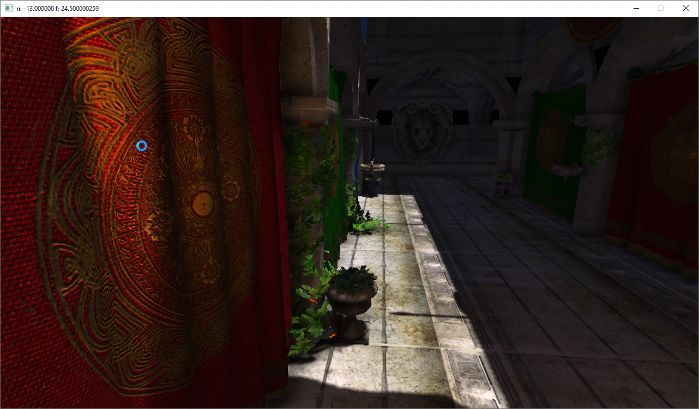
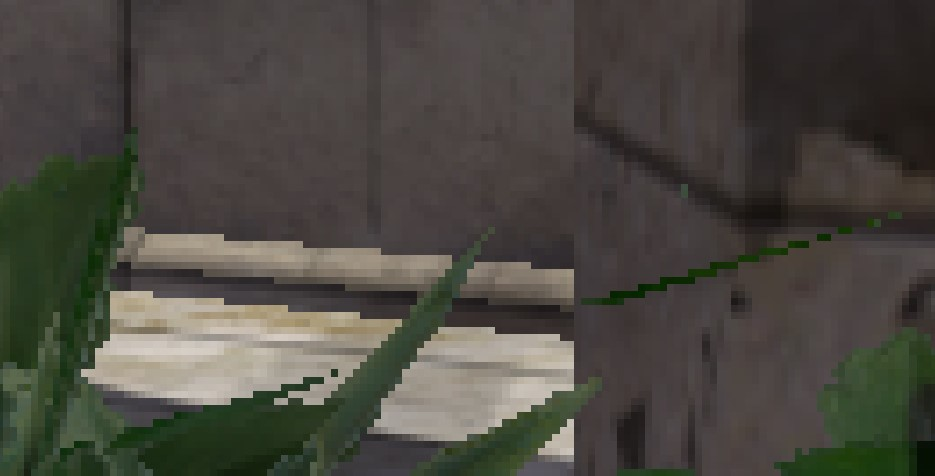
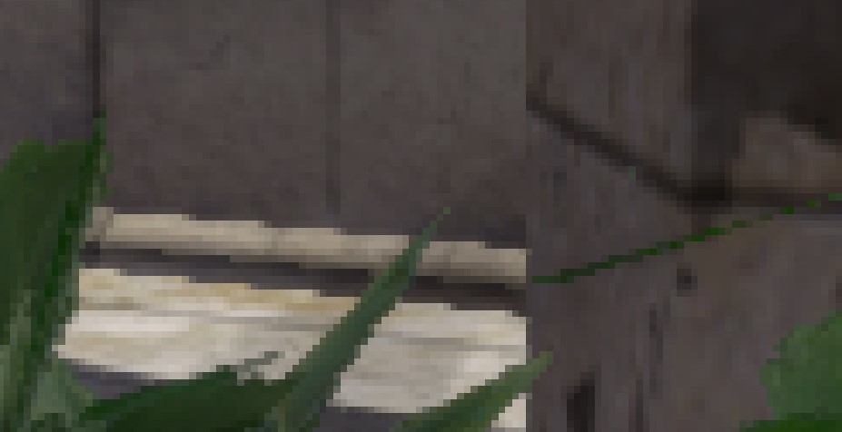
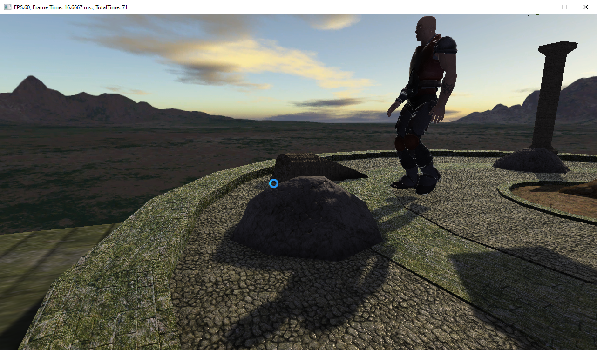

This DirectX 11 demo includes SSAO, shadow mapping, BRDF light, FXAA (based on NVIDIA white paper).
In order to run it, switch platform to x64.
Use WASD to control camera, hold left mouse button to control view directon, R to reset camera position, 5 to disable SSAO.

Sponza castle

FXAA on/off

This scene is based on Frank Luna's book, includes character animation
Demo in action: https://youtu.be/oOEK57hT8gs
