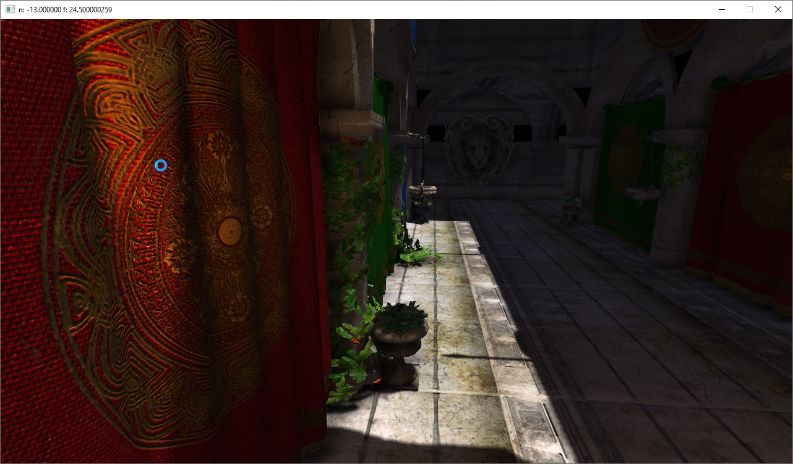
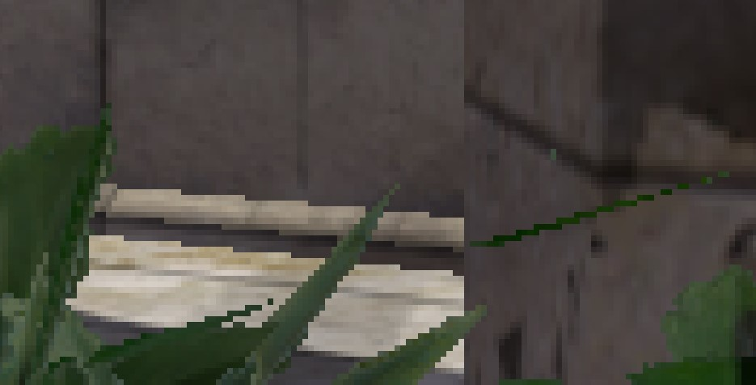
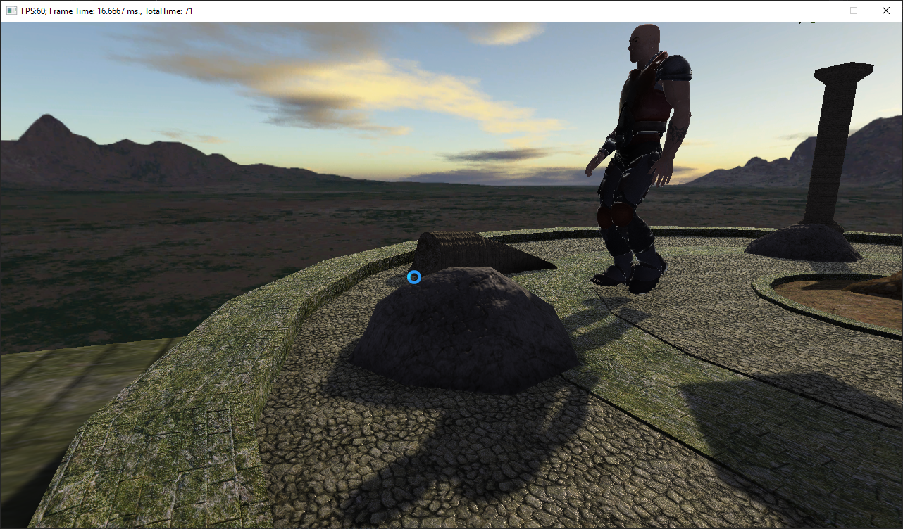

This DirectX 11 demo includes 
SSAO
shadow mapping
BRDF light
FXAA (based on NVIDIA white paper)
occlusion culling with AABB
In order to run it, switch platform to x64.
Use WASD to control camera, hold left mouse button to control view directon, R to reset camera position, 5 to disable SSAO, 1 to enable FXAA.

Sponza castle

FXAA on/off

This scene is based on Frank Luna's book, includes character animation
Demo in action: https://youtu.be/oOEK57hT8gs

